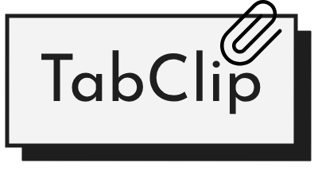
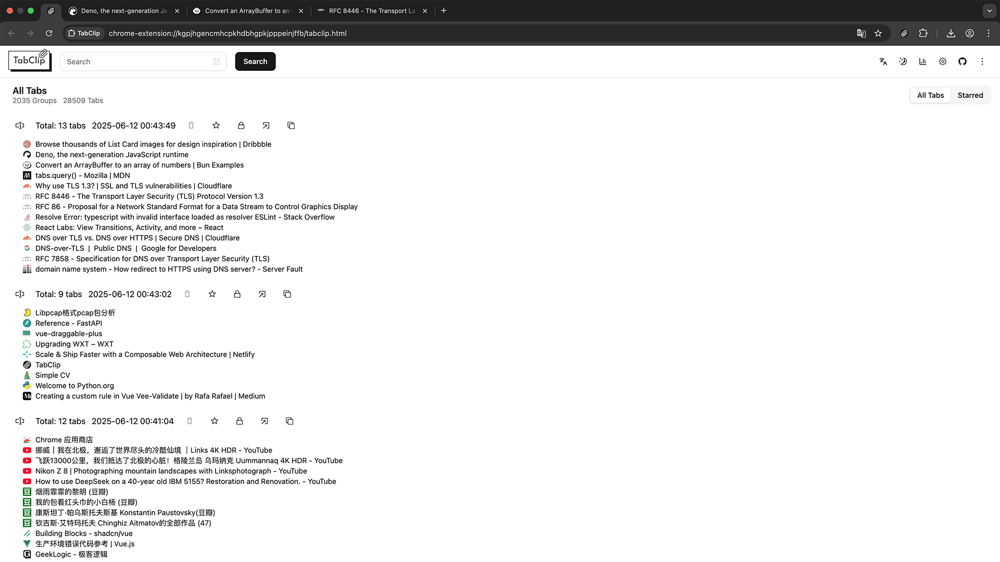
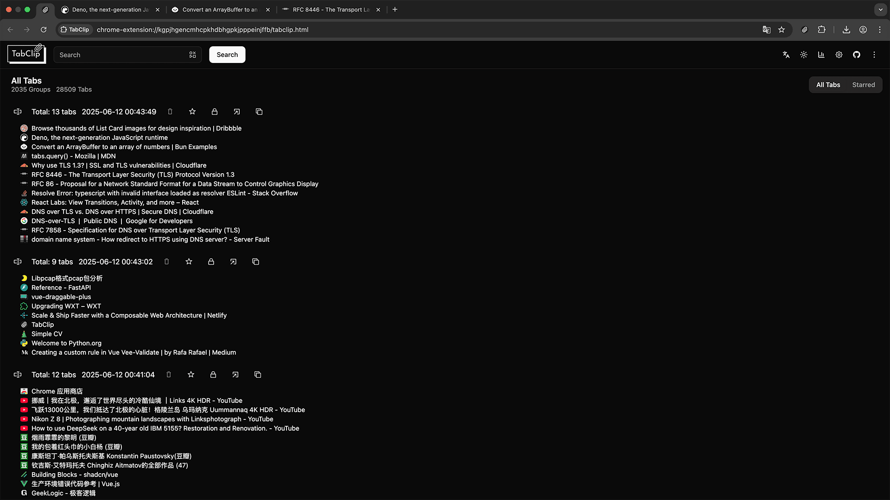
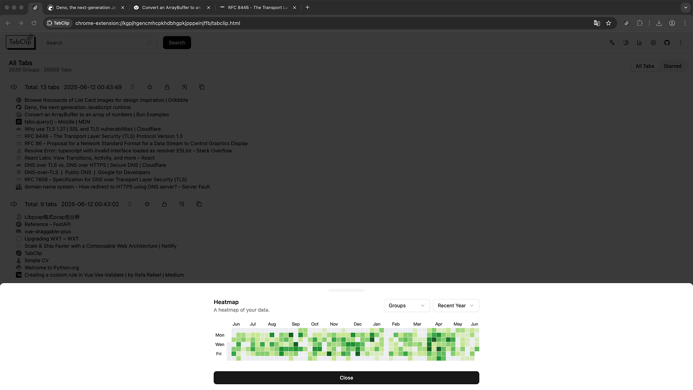
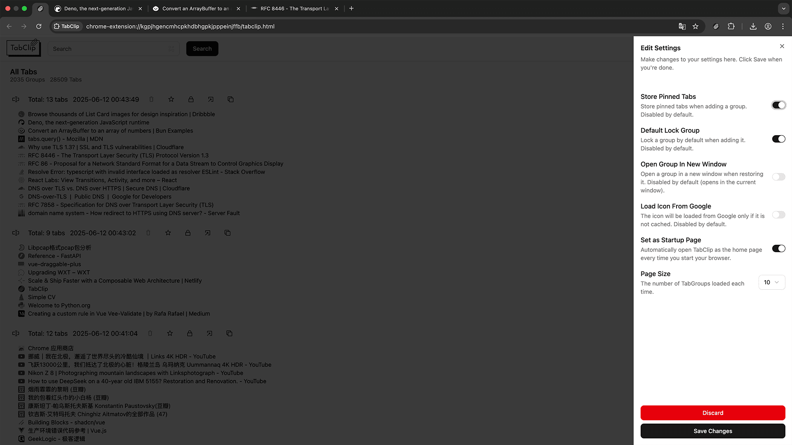

<p align="center">
 
 <p align="center">
  <em>Clip your tabs together like a paperclip!</em>
 </p>
 <p align="center">TabClip: A Chrome/Edge extension for managing and archiving large numbers of tabs.</p>
 <h4 align="center"><strong>English</strong> | <a href="https://github.com/Heaciy/TabClip/blob/main/README_zh.md">简体中文</a></h4>
</p>

## Installation

- Google Chrome Web
  Store: [Chrome Web Store](https://chromewebstore.google.com/detail/tabclip-tab-manager/hncnlhjjpjcdohgcgbjoeogibifmfchf)
- Microsoft Edge
  Add-ons: [Microsoft Edge Addons](https://microsoftedge.microsoft.com/addons/detail/decldfllagpggbilmhhccehcmcafmmmh)
- Firefox Browser Add-ons: [Firefox Browser Addons](https://addons.mozilla.org/en-GB/firefox/addon/tabclip-tab-manager/)

## Introduction

- **What it is**: TabClip is a browser extension for managing large numbers of tabs. It currently supports Chrome,
  Edge (Chromium-based), and Firefox.
- **Who it's for**: If you frequently have many tabs open in your browser and don't want to close them all when your
  work is finished (or unfinished), TabClip lets you archive all or some of your tabs (perfect for digital hoarders like
  me).
- **Why I developed this extension**: Similar extensions already exist, like OneTab which I used previously. However, as
  time passed, my OneTab accumulated massive data—about 2000+ tab groups with 30000+ tabs (my bad habit!). OneTab stores
  all data in a single JSON string, requiring serialization/deserialization for every operation, and renders all data at
  once, making the extension extremely sluggish! It also consumes an unacceptable amount of memory, about 1.5GB! This
  contradicts OneTab's claim of "saving 90% of your memory," and its export function only exports titles and URLs (
  losing group and timestamp information)... So if you're also troubled by these issues, try TabClip—I hope you'll like
  it.
- **Reasons to choose TabClip**: Simple interface and functionality, ability to store enormous amounts of data, support
  for importing data from OneTab.

## Features

- Simple operation: One-click collapse or restore all tabs
- Modern UI: Built with Shadcn-Vue + Tailwindcss
- Multi-language support: Currently supports Chinese and English, with more languages coming soon
- Color theme switching: Switch between light and dark modes according to preference
- Saves significant memory: Data lists use scroll loading, displayed chronologically
- Quick search support: Search by keywords in titles, quickly filter by time, and easily find favorited items
- Tab group management: Delete, favorite, or lock tab groups; copy all links with one click; drag and reorder tabs
  within one or multiple tab groups
- Import and export data: Support for importing and exporting data, exporting to JSON files with all metadata, and
  importing data files exported from OneTab using tools
- Fun features: GitHub-style heatmap to visualize your tab activity at a glance

## Build Guidelines

### 1. Clone the Repository

```bash
git clone https://github.com/Heaciy/TabClip.git
cd TabClip
```

### 2. Install Dependencies and Build

```bash
npm install
# Build Chrome extension
npm run zip
# Build Edge extension
npm run zip:edge
# Build Firefox extension
npm run zip:firefox
```

### 3. Install on Your Browser

- Enter the Chrome/Edge extension management page
- Open the developer mode
- Click to load the unzipped extension

## Screenshots

### Light Mode



### Dark Mode



### Heatmap



### Settings


